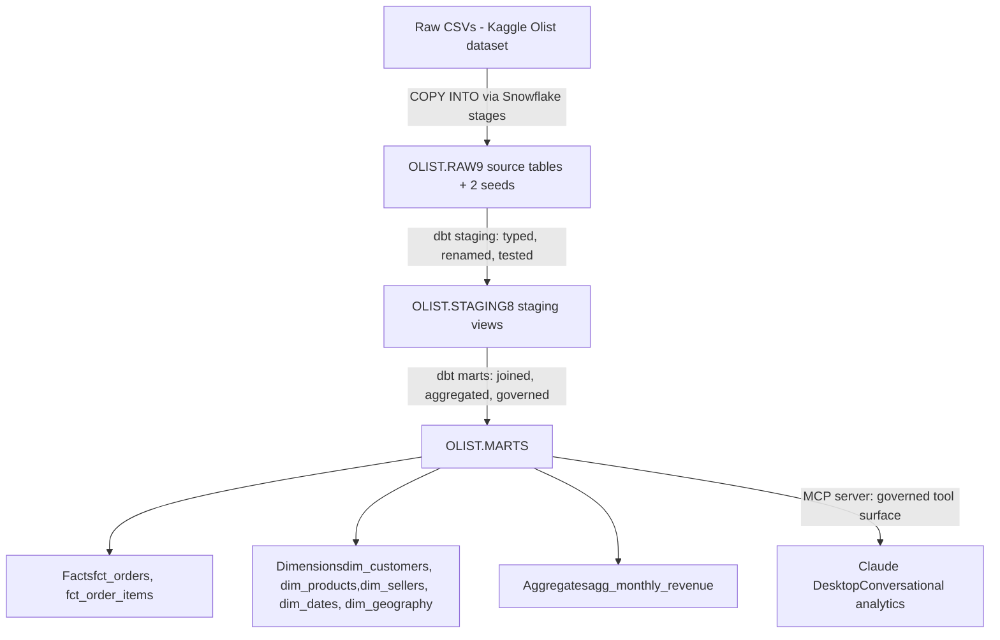

# Conversational Analytics Platform — Olist Brazilian E-Commerce

A governed, LLM-queryable analytics layer built on real e-commerce data. Ask Claude an executive-level analytics question in plain English; get a trustworthy answer backed by certified metric definitions, a tested dimensional model, and a curated query surface.

The project's core thesis: **the hard part of putting an LLM on a database isn't the LLM — it's making the data trustworthy enough that an LLM can safely sit on top of it.**

---

## What this demonstrates

Built end-to-end on a real dataset (Olist Brazilian e-commerce, ~100k orders across 9 source tables), this project covers the analytics-engineering craft from raw CSV to production-shape LLM consumption:

- **Cloud data warehouse** on Snowflake, with layered schemas and clean separation of raw / staging / marts
- **Dimensional modeling in dbt** with grain discipline, conformed dimensions, and revenue conservation verified end-to-end
- **Tested data layer** — 35+ tests covering primary keys, composite keys, referential integrity, accepted values, and uniqueness
- **Metric governance** — certified `bookings` and `revenue` definitions embedded in code, with documented business choices (delivered vs canceled, product revenue vs total transaction value)
- **LLM-ready schema documentation** — every model and column described with usage guidance, gotchas, and canonical-column hints, so the LLM can query the data correctly
- **MCP server** exposing the warehouse to Claude with enforced governance — restricted query surface (marts only), read-only validation, manifest-driven schema context

---

## Architecture



**Tech stack:** Snowflake · dbt (Fusion engine) · Python · MCP · Claude · GitHub

---

## Selected design decisions

A few decisions worth calling out, because they're the substance of the project:

### Grain discipline as the spine of correctness
The most failure-prone moment in any e-commerce model is double-counting from misaligned grains. Each fact table here declares its grain explicitly, and every "many-to-one" relationship (line items per order, payments per order, reviews per order) is aggregated *before* joining. Verified end-to-end with a revenue conservation check: sum of `price` from `fct_order_items` exactly equals sum of `product_revenue` rolled up to `fct_orders`. Same answer, two paths.

### Bookings vs revenue as separate certified metrics
The dataset supports two legitimate revenue-side definitions: **bookings** (commitments, non-canceled orders) and **revenue** (realized, delivered orders only). Rather than picking one and losing the other, both live as distinct measures in `agg_monthly_revenue`. The gap between them — operational reality like cancellations and in-flight orders — becomes its own informative metric.

### Customer grain that respects the source quirk
Olist assigns a new `customer_id` per order — so the customers table has 99,441 rows but only 96,096 distinct people. `dim_customers` is grained on `customer_id` for clean joins to facts, with `customer_unique_id` carried as a column. "How many customers" is then a metric-layer decision (`count(distinct customer_unique_id)`), not silently baked into row counts. Documented explicitly in the schema so the LLM doesn't confuse them.

### LLM-aware schema documentation
Every column description is written for the LLM as much as a human reader. Canonical columns are labeled ("the canonical revenue measure — use this"); ambiguous columns are explicitly directed ("for display only, group by `year_month` instead"); known traps are flagged in-line. The result: when Claude generates SQL, it uses `is_delivered` (not `order_status = 'delivered'`), `product_revenue` (not `order_total`), and `count(distinct customer_unique_id)` (not `count(*)`) — because the descriptions tell it to.

### MCP as a governance layer
The Python MCP server is deliberately not just a thin Snowflake connector. It exposes two tools: `get_schema_context()` (returns curated mart descriptions, drawn from `manifest.json` so the dbt YAML is the source of truth) and `run_query()` (validates SQL, rejects writes, caps result size, restricts surface to MARTS). Claude has access to your data *through* the governance, not around it.

---

## Repository structure

```
brazil-ecommerce-olist/
├── data_analysis/          # Exploratory data profiling
│   └── profile_olist.py
├── olist_analytics/        # The dbt project
│   ├── models/
│   │   ├── staging/        # 8 staging models + tests
│   │   └── marts/          # Facts, dimensions, aggregates + tests
│   ├── macros/             # Custom schema-routing macro
│   ├── seeds/              # Category translation, Brazilian geography
│   └── dbt_project.yml
├── analytics_app/          # The Claude integration
│   ├── server.py           # MCP server with governance tools
│   └── requirements.txt
└── README.md
```


## Running it yourself

This project assumes you have a Snowflake account and the Olist data loaded into `OLIST.RAW`. To rebuild from there:

```bash
# Set up dbt
cd olist_analytics
dbtf debug                  # confirm Snowflake connection
dbtf seed                   # load the reference seeds
dbtf build                  # build all models + run all tests
dbtf compile --write-catalog  # generate manifest for the MCP server

# Set up the MCP server
cd ../analytics_app
python3.12 -m venv venv
source venv/bin/activate
pip install -r requirements.txt
# Create .env with Snowflake credentials (see analytics_app/.env.example)
```

Then configure Claude Desktop to launch `analytics_app/server.py` as an MCP server (see Anthropic's MCP docs for the config file format) and restart Claude Desktop.

---

## What's next

Honest forward-looking work, not all of which is built yet:

- **Eval framework** — a Python harness running benchmark questions through Claude and comparing execution results to canonical SQL, producing a defensible accuracy metric.
- **Production-scale cost optimization** — Anthropic prompt caching on the schema context, two-stage retrieval to send only relevant tables, model cascading (cheap model for routing, capable model for SQL).
- **Semantic layer formalization** — MetricFlow definitions for the certified metrics, exposed by name so the LLM calls them rather than regenerating SQL.
- **Marketing-funnel subject area** — extending the model to incorporate Olist's marketing dataset as a second subject area, joined through conformed seller dimensions.

---

## About the data

[Olist Brazilian E-Commerce Public Dataset](https://www.kaggle.com/datasets/olistbr/brazilian-ecommerce) — real, anonymized marketplace orders from 2016–2018. 9 related tables covering customers, sellers, orders, items, payments, reviews, products, geography, and category translations. Chosen for its authentic relational complexity, multi-grain joins, and genuine data-quality challenges (Portuguese categories needing translation, nulls with semantic meaning, composite keys).